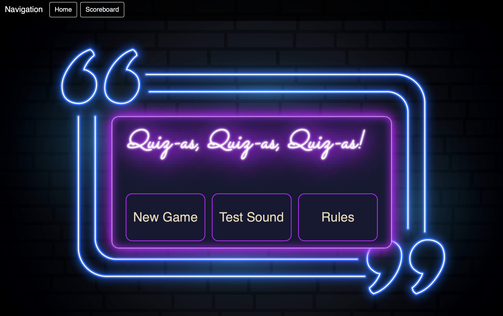
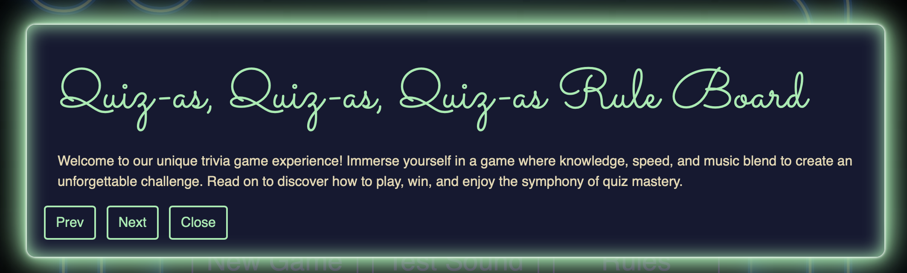
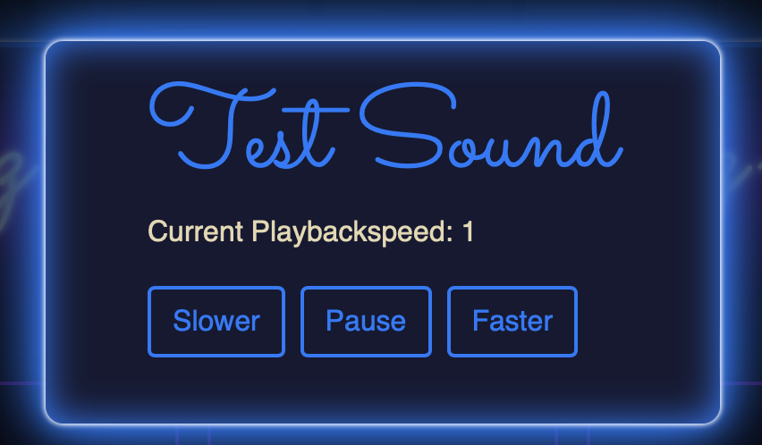
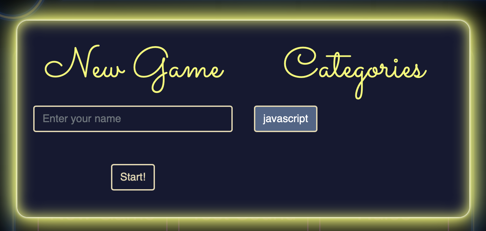
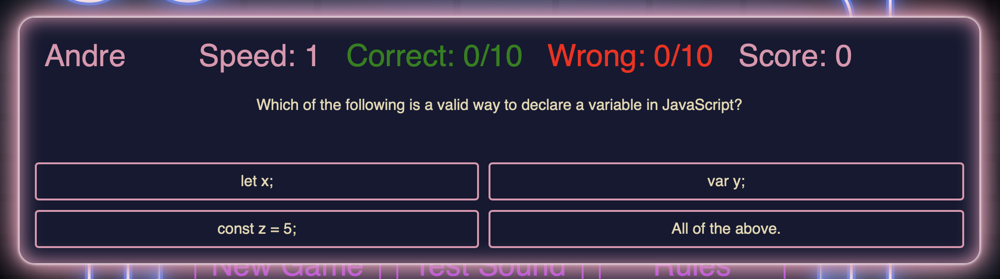
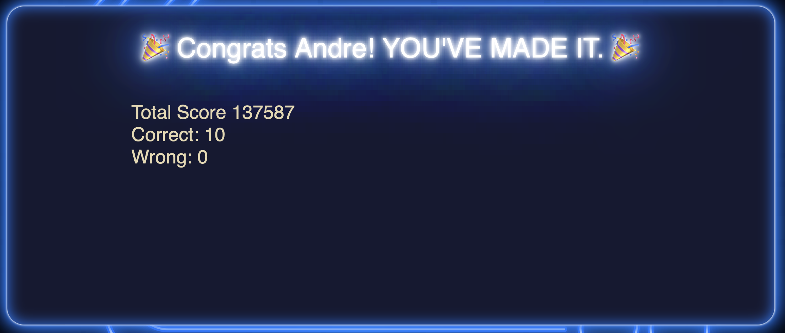
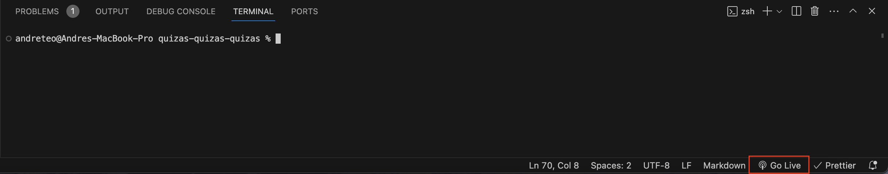
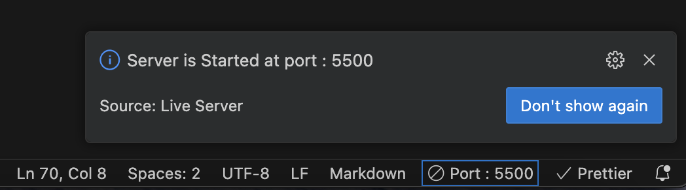

# Quiz-as, Quiz-as, Quiz-as!

## Description

Welcome to _Quiz-as, Quiz-as, Quiz-as_. It is a web-based trivia game that not only challenges players' knowledge, but also their speed and steadfastness in the face of a ticking clock. In _Quiz-as, Quiz-as, Quiz-as_, players find themselves immersed in an increasingly fast-paced trivia adventure where every second counts.

Forget the clock! In this game, time is measured by the duration of [_Quizas, Quizas, Quizas_](https://www.youtube.com/watch?v=xYz5CiEy5bY) by Andrea Boccelli song duration. . Answer all questions before the final note fades.

## Overview

### Key Features

-   Users can explore a range of quiz topics. (Currently only has Javascript, but it's simple to add more topics to the .json file in the future).
-   Dynamically timed gameply: Users are pitched against the clock to finish all questions before time runs out. The catch is, every wrong answer entered increases the playback rate. The more mistakes made, the less time the user has to complete.
-   Randomized questions: A set number of questions from a chosen list of categories is randomly selected from a pool of questions from the questions.json file.
-   _(To be implemented)_ Scoreboard - Players' scores will be recorded after every game and saved in a scoreboard. They must race to answer all questions correctly as quickly as possible for a spot in the top.

### Screenshots

<figure>
      
      <figcaption><strong><span style="color: #0b7bfb">Main Landing Page</span></strong><br>Shows the Navbar with two options - Home and Scoreboard. Home takes you to the main landing page as seen below, while Scoreboard will take you to a scoreboard page.</figcaption>
</figure>

<figure>
      
      <figcaption><strong><span style="color: #98ecae">Rules</strong></span><br>Like every new player, to get a good understanding of the game, they'd first take a look at the game rules. The _Rules_ button is clicked where the user will be briefed clearly on the rules of the game.</figcaption>
</figure>

<figure>
      
      <figcaption><strong><span style="color: #0b7bfb">Test Sound</span></strong><br>This button simply allows the user to preview Quizas, Quizas, Quizas and have a listen before starting the actual game. The user is also able to increase/decrease the playback rate for testing purposes. </figcaption>
</figure>

<figure>
      
      <figcaption><strong><span style="color: #f4f966">New Game</span></strong><br>To start the game, players will click on the _New Game_ button, after which a _New Game Modal_ will pop up and prompt them to enter a name, and choose the desired categories. Once completed, the _Start!_ button is clicked to begin the game </figcaption>
</figure>

<figure>
      
      <figcaption><strong><span style="color: #e195af">Quiz Board</span></strong><br> Once the _Start!_ button is clicked, the player is taken to the main game (Quiz) board, and the song starts playing. This is where players will answer a series of questions. The number of questions is configurable (See Section _Configuration_). This page has two outcomes: Win/Lose. </figcaption>
</figure>

<figure>
      
      <figcaption><strong><span style="color: #0b7bfb"> Player Successful Completion</span></strong><br> This page is shown when the player has successfully completed the quiz, by which all questions have been answered before the end of the song. It doesn't matter if the player has only 1 question correct or not. It appears as long as they complete before the song ends. </figcaption>
</figure>

<figure>
      
      <figcaption><strong><span style="color: #d07214"> Player Unsuccessful </span></strong><br> This page is shown when the player is unsuccessful and does not manage to answer all quiz questions before the song ends.  </figcaption>
</figure>

## Installation

### Pre-requisites

Currently this game is deployed locally. The pre-requisites are as follows:

-   Access to the [Repository](https://github.com/andreteo/quizas-quizas-quizas.git). It's public, shouldn't be an issue.
-   Git
-   VSCode
    -   Extension: Live Server (Extension ID: ritwickdey.LiveServer)
    -   Extension: Prettier (Extension ID: esbenp.prettier-vscode)

To get started with _Quiz-as, Quiz-as, Quiz-as_, follow the steps below:

1. Clone the repository to your local machine using Git:

```bash
https://github.com/andreteo/quizas-quizas-quizas.git
```

2. Navigate to the Project Directory. Change into the directory where you cloned _Quiz-as, Quiz-as, Quiz-as_.

```bash
cd ~/quizas-quizas-quizas
```

3. Open the project directory in VSCode from terminal:

```bash
code .
```

## Usage

1. Start _Quiz-as, Quiz-as, Quiz-as_ locally using Live Server.

-   With Live Server installed, click _Go Live_ at the bottom-right of VSCode.
    <figure>
      
      <figcaption>"Go Live" Button</figcaption>
    </figure>
-   After starting the server, a window should automatically open in your default browser and the _Go Live_ now shows the port number of the local server. Otherwise, you can manually open the page by entering `http://localhost:<portnumber>` in your browser.<br>
    <figure>
      
      <figcaption>Server started</figcaption>
    </figure>

## Configuration

-   <strong>Song playback rate</strong> can be changed in the source code ./script.js. This increases/decreases the playback rate which is initialized to a value of 1.0 by simply adding/subtracting the input value. The actual value is changed within the AudioPlayer class in class.js file.

    <span style="color: gray">script.js</span>

    ```js
    const SPEEDUP = 1.0;
    ```

    <span style="color: gray">class.js - Increase Playback Speed</span>

    ```js
    const newSpeed = this.playbackSpeed + this.speedup;
    this.playbackSpeed = Math.round(newSpeed * 100) / 100;
    ```

    <span style="color: gray">class.js - Decrease Playback Speed</span>

    ```js
    const newSpeed = this.playbackSpeed - this.speedup;
    this.playbackSpeed = Math.round(newSpeed * 100) / 100;
    ```

-   <strong>Number of questions</strong> is set using `NUMQ` global variable in script.js. This determined the total number of questions that will be randomly sampled. Obviously, the number of questions in your questions.json file must be >= `NUMQ`.

    ```js
    const NUMQ = 10;
    ```

-   <strong>Question bank file</strong> is imported in not in .js file but in .html as a `<script></script>`. You can specify a variable name and reference that in your actual .js file

    ```html
    <script type="text/javascript" src="./docs/questionbank.json"></script>
    ```

    ```js
    fetchQuestions() {
        this.allQuestions = this.flattenQuestions(questionbank);
    }
    ```

-   <strong>Background song file</strong> is defined as a default value in the AudioPlayer's class' constructor. This can be changed should you want to have a different background song. The song file is kept in ./media/

    ```js
    class AudioPlayer {
        constructor(
            audio = "./media/Andrea-Bocelli_Quizas,Quizas,Quizas_ft.-Jennifer-Lopez.mp3",
            timeElapsed = 0.0,
            isPlaying = false,
            playbackSpeed = 1.0,
            speedup = SPEEDUP
        ) {
            this.audio = new Audio(audio);
            this.timeElapsed = timeElapsed;
            this.isPlaying = isPlaying;
            this.playbackSpeed = playbackSpeed;
            this.speedup = speedup;
        }
    }
    ```

## Data Structure of Question Bank

The question bank is organized as a JavaScript object named `questionbank`. It can consist of multiple topics, each containing an array of questions related to that topic.

```json
const questionbank = {
  "topic1": {
    "questions": [
      {
        "question": "question1",
        "answers": [
          "answer1",
          "answer2",
          "answer3",
          "answer4"
        ],
        "correct": 2
      },
      {
        "question": "question2",
        "answers": [
          "answer1",
          "answer2",
          "answer3",
          "answer4"
        ],
        "correct": 3
      }
    ]
  }
}
```

### Structure Explanation:

-   **`questionbank`**: This is the main object that contains all the topics and their associated questions.

-   **Topics**: Each topic within the `questionbank` object is represented as a key-value pair, where the key is the name of the topic (e.g., `"topic1"`), and the value is an object containing the questions related to that topic.

-   **Questions Array**: Inside each topic object, there's a key named `"questions"`, which holds an array of question objects. Each question object represents a single question and its details.

-   **Question Object**: Each question object contains the following properties:
    -   **`question`**: The actual question text.
    -   **`answers`**: An array of 4 possible answers to the question.
    -   **`correct`**: The index of the correct answer within the `answers` array. As with Javascript notation, the index starts from 0.

### Example:

-   For the `"topic1"` topic:
    -   It contains an array of two questions.
    -   The first question's (`question1`) correct answer is at index 2 (`"answer3"`).
    -   The second question's (`question2`) correct answer is at index 3 (`"answer4"`).

This structure allows for easy organization and retrieval of questions based on different topics, making it convenient for users to manage and access quiz content in the _Quiz-as, Quiz-as, Quiz-as_ application.

## Classes

#### AudioPlayer

The `AudioPlayer` class handles audio playback functionalities within the application. It encapsulates features such as playing, pausing, resetting, and adjusting playback speed of audio files.

##### Properties:

-   `audio`: Represents the audio element to be played.
-   `timeElapsed`: Tracks the elapsed time of the audio playback.
-   `isPlaying`: Indicates whether the audio is currently playing.
-   `playbackSpeed`: Represents the current playback speed of the audio.
-   `speedup`: Specifies the amount by which the playback speed is increased or decreased.

##### Methods:

-   `playAudio()`: Initiates playback of the audio.
-   `pauseAudio()`: Pauses the audio playback.
-   `resetAudio()`: Resets the audio to the beginning.
-   `increasePlaybackSpeed()`: Increases the playback speed of the audio.
-   `decreasePlaybackSpeed()`: Decreases the playback speed of the audio.
-   `saveMetadata()`: Returns metadata related to the audio playback, including playback rate and elapsed time.

#### Player

The `Player` class represents a player within the trivia game. It stores information about the player, including their ID, name, scores, and performance statistics.

##### Properties:

-   `playerId`: Unique identifier for the player.
-   `playerName`: Name of the player.
-   `playerScores`: Array containing the scores achieved by the player.
-   `numCorrect`: Number of correct answers given by the player.
-   `numWrong`: Number of wrong answers given by the player.
-   `totalScores`: Total accumulated scores of the player.

#### Scoreboard

The `Scoreboard` class manages the scoreboard functionality of the game. It keeps track of all players and their scores.

##### Properties:

-   `allplayers`: Object containing all player instances.
-   `currentPlayer`: Reference to the current player.

##### Methods:

-   `addPlayer(playerName)`: Adds a new player to the scoreboard.
-   `generatePlayerId()`: Generates a unique player ID based on the current timestamp and a random string.
-   `updateScore(points)`: Updates the score of the current player.
-   `recordCorrectAnswer()`: Records a correct answer given by the current player.
-   `recordWrongAnswer()`: Records a wrong answer given by the current player.
-   `getTotalScore()`: Calculates and returns the total score of the current player.

#### QuestionMaster

The `QuestionMaster` class handles the management of quiz questions and gameplay. It facilitates functionalities such as fetching questions, starting the game, and processing player responses.

##### Properties:

-   `topics`: Array containing topics/categories of questions.
-   `getNum`: Number of questions to fetch for the quiz.
-   `gameStarted`: Indicates whether the game has started.
-   `curPage`: Current page/question number.
-   `curQuestion`: Current question being displayed.
-   `curAnswer`: Answers to the current question.
-   `correct`: Index of the correct answer.
-   `advancePage`: Indicates whether to advance to the next question.
-   `startTime`: Timestamp indicating when the game started.
-   `elapsedTime`: Elapsed time since the start of the game.
-   `veryFirstQuestion`: Flag to track if it's the first question.
-   `endTheGame`: Flag to indicate if the game has ended.

##### Methods:

-   `fetchQuestions()`: Fetches a subset of questions from the question bank.
-   `startGame()`: Starts the quiz game.
-   `populateQuizScreen()`: Populates the quiz screen with questions and answers.
-   `questionButtonsHandler(e)`: Handles user interaction with question buttons.
-   `toggleClickEventListeners(enable)`: Toggles event listeners for question buttons.
-   `updateQuizScores()`: Updates the scoreboard with player scores and statistics.
-   `calculateScore(elapsedTime)`: Calculates the score based on the elapsed time.
-   `startTimer()`: Starts the timer for tracking elapsed time.
-   `stopTimer()`: Stops the timer.
-   Utility functions for text manipulation and UI interactions are also included within the script.

## File Structure

```bash
.
├── README.md
├── class.js
├── docs
├── fonts
├── index.html
├── media
├── script.js
└── style.css
```

### Documentation

`Dir: ./docs`<br>
Documentation such as wireframes and question bank .json files are stored here.

### Fonts

`Dir: ./fonts`<br>
Downloaded font files. Usage of local font files are as follows:

```css
@font-face {
    font-family: "Roboto", sans-serif;
    src: url("fonts/Roboto-Regular.ttf") format("truetype");
}
```

### Media

`Dir: ./media`<br>
Media files including audio .mp3, videos .mp4, and screenshots .png.

### Source Code

| File      | Type | Desc                                      |
| --------- | ---- | ----------------------------------------- |
| script.js | JS   | Main entry point                          |
| class.js  | JS   | Classes are declared and initialized here |
| style.css | CSS  | Styling document                          |

# References

| Category | Desc.                                                              | URL                                                                                                                                                    |
| -------- | ------------------------------------------------------------------ | ------------------------------------------------------------------------------------------------------------------------------------------------------ |
| HTML     | Main Trivia Background Image                                       | [Link](https://www.freepik.com/free-vector/neon-blue-quotation-frame-with-text-space_12320014.htm?query=trivia%20background#from_view=detail_alsolike) |
| CSS      | Box Shadow Examples                                                | [Link](https://getcssscan.com/css-box-shadow-examples)                                                                                                 |
| CSS      | Color Palettes                                                     | [Link](https://coolors.co/palette/dad7cd-a3b18a-588157-3a5a40-344e41)                                                                                  |
| CSS      | Bootstrap Documentation                                            | [Link](https://getbootstrap.com/docs/4.0/utilities/flex/#justify-content)                                                                              |
| CSS      | Online Color Value Picker                                          | [Link](https://imagecolorpicker.com/en)                                                                                                                |
| CSS      | Neon Text                                                          | [Link](https://codepen.io/silvia-odwyer/pen/RwKMOpb)                                                                                                   |
| JS       | JS Audio Object                                                    | [Link](https://developer.mozilla.org/en-US/docs/Web/HTML/Element/audio)                                                                                |
| JS       | Click Outside Element Example                                      | [Link](https://www.30secondsofcode.org/js/s/listen-click-outside-event/)                                                                               |
| JS       | How to Read JSON File                                              | [Link](https://www.freecodecamp.org/news/how-to-read-json-file-in-javascript/)                                                                         |
| JS       | How to Shuffle an Array                                            | [Link](https://www.freecodecamp.org/news/how-to-shuffle-an-array-of-items-using-javascript-or-typescript/)                                             |
| JS       | If Background is Dark {textColour = #fff} else {textColour = #000} | chatGPT                                                                                                                                                |
| JS       | Google                                                             | [Link](https://fonts.google.com/selection/embed)                                                                                                       |

# Next Steps

|           Feature            | Remarks                                                                                                                                                                                                                               |
| :--------------------------: | ------------------------------------------------------------------------------------------------------------------------------------------------------------------------------------------------------------------------------------- |
|       Game Pause/Play        | the AudioPlayer class has some methods implemented such as saveMetaData() to save the song's elapsed time etc. for the pause/play function.                                                                                           |
|          Game Reset          | This should reset all event listeners/modal windows/etc such that it is as though the user has just refreshed or entered the page.                                                                                                    |
|    Save and Quit/Continue    | Current idea is to save current player's relevant metadata (audio metadata/player metadata/score metadata) into LocalStorage, and when the user wants to continue, everything can be obtained easily dedpite page refresh/page close. |
|          Scoreboard          | Scoreboard class is in place, it'll hold a library of <strong>_Players_</strong>. When Scoreboard item from the Navbar is clicked, it'll generate a table and display on a different page, maybe `score.html`?                        |
| Implement more trivia topics | HTML, CSS, etc.                                                                                                                                                                                                                       |

# ChatGPT

Me:
I'm thinking of the following JSON structure for my question bank.
what do you think? analyse pros/cons, advise me about it.

```json
{
  "JavaScript": {
    "questions": [
      {
        "question": "What is JavaScript?",
        "answers": [
          {text: "JavaScript is a low-level programming language.", isCorrect: true/false},
          {text:"JavaScript is primarily used for server-side programming.", isCorrect: true/false},
          {text:  "JavaScript is a markup language for styling web pages.", isCorrect: true/false},
          {text: "JavaScript is a high-level, interpreted programming language." isCorrect: true/false},
        ]
      },
    ]
  }
}
```

ChatGPT:

```md
Your proposed structure for storing question bank data with explicit correctness flags for each answer is a solid approach and offers several benefits:

**Pros**:

1. **Clarity and Explicitness**: By explicitly specifying whether each answer is correct or wrong, the data structure becomes clear and self-explanatory. This can improve readability and make it easier for developers to understand the data.

2. **Flexibility**: Your structure allows for flexibility in handling different types of questions and answers. Each answer object can have its own correctness flag, allowing for variations in the number of correct and incorrect answers for each question.

3. **Ease of Processing**: With the correctness flag included directly in each answer object, it's straightforward to programmatically process the data, such as checking user responses against correct answers or calculating scores.

4. **Scalability**: Your structure scales well with the addition of new questions and answers. You can easily expand the question bank by adding new question objects without needing to modify the overall structure.

**Cons**:

1. **Increased Data Size**: Including a separate correctness flag for each answer adds redundancy to the data structure, potentially increasing its size. However, in most cases, the impact on data size is negligible.

2. **Potential for Errors**: Maintaining correctness flags for each answer requires careful attention to ensure accuracy. If correctness flags are not updated correctly or consistently, it could lead to inaccuracies in the data.

Overall, your proposed structure strikes a good balance between clarity, flexibility, and ease of processing. It provides a clear and explicit representation of question and answer data while allowing for variations in correctness. As long as you ensure correctness flags are maintained accurately, this structure should serve your needs well for managing a question bank.
```

Follow up:
Me:
what are the industry standards in storing a question bank? give me the data structure

ChatGPT:
There isn't a single industry standard for storing a question bank as it can vary depending on factors such as the specific requirements of the application, the complexity of the questions, and the preferences of the development team. However, there are common practices and considerations that are often followed in designing the data structure for a question bank.

Here's a generalized data structure for storing a question bank:

```json
{
    "categories": [
        {
            "name": "JavaScript",
            "questions": [
                {
                    "id": 1,
                    "text": "What is JavaScript?",
                    "answers": [
                        { "text": "JavaScript is a high-level, interpreted programming language.", "isCorrect": true },
                        { "text": "JavaScript is a low-level programming language.", "isCorrect": false },
                        { "text": "JavaScript is primarily used for server-side programming.", "isCorrect": false },
                        { "text": "JavaScript is a markup language for styling web pages.", "isCorrect": false }
                    ]
                }
                // Additional questions...
            ]
        }
        // Additional categories...
    ]
}
```

Explanation:

Categories: The question bank is organized into different categories or topics (e.g., JavaScript, HTML, CSS). Each category contains a list of questions related to that topic.
Name: The name of the category/topic.
Questions: An array of question objects belonging to the category.
Questions: Each question object represents a single question in the question bank.
ID: An identifier for the question (optional but useful for referencing questions).
Text: The text of the question itself.
Answers: An array of answer objects representing the possible answers to the question.
Text: The text of the answer.
isCorrect: A boolean flag indicating whether the answer is correct or not.
This data structure provides a hierarchical organization of questions by category and allows for flexibility in representing different types of questions (e.g., multiple-choice, true/false). It's also easily expandable, allowing for the addition of new categories and questions as needed.

While this structure reflects common practices, the specific requirements of your application may dictate variations or additional features. For example, you might include metadata such as difficulty level, tags, or explanations for each question. Adjustments can be made based on your application's needs and the complexity of your question bank.
